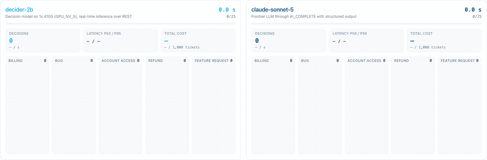

# Decision triage board

A Snowflake App Runtime (Next.js) demo: the same stream of support tickets is triaged live, side by side, by
decider-2b and by a frontier LLM. For each ticket both sides make the same two decisions, which team handles it
(billing, bug, account access, refund, feature request) and whether to escalate it. Each board shows the elapsed time, the decision count with decisions per second, p50/p95 latency,
and the total cost with $ per 1,000 tickets. A run defaults to 25 tickets with one request in flight per
side; both are adjustable above the boards.



- **decider-2b**: the `DECIDER_2B` model from the Model Registry, run as a real-time inference service
  (`DECIDER_2B_DEMO`, one GPU_NV_S node) and called over its REST endpoint.
- **LLM**: `AI_COMPLETE` with structured output (default `claude-sonnet-5`; set `LLM_MODEL` to change it).
- **Tickets**: `DEVREL.DECISION_MODEL_BLOG.DEMO_TICKETS`, 1,000 synthetic tickets from `sql/01_demo_tickets.sql`.

Both sides get the same instructions and criteria (`lib/questions.ts`). Latency is timed on the app server around
each model call. Costs are estimates at list price from the Service Consumption Table (`lib/config.ts`): decider-2b
is GPU node time while requests are in flight; the LLM is input and output tokens plus the XS warehouse
`AI_COMPLETE` runs on.

In our 25-ticket run with one request in flight per side, decider-2b finished all 25 in 3.9 s: 6.5 decisions
per second, 115 ms median latency, $0.049 per 1,000 tickets. `claude-sonnet-5` made 10 in 23.0 s: 0.5 per
second, 2.17 s median latency, $4.98 per 1,000 tickets. That's the GIF above, paused at 10 LLM decisions.

## Setup

The names below are the defaults in `app.yml`, `lib/config.ts` (`TICKETS_TABLE`, `DECIDER_SERVICE`,
`LLM_MODEL`, `LLM_WAREHOUSE`) and `sql/01_demo_tickets.sql`; change them there for your own database and
schema.

1. Tickets: `snow sql -c <connection> -f sql/01_demo_tickets.sql` (creates `DECIDER_DEMO_WH` first if needed).
2. decider-2b service with a public endpoint, from the repo root, after the service path in the root
   README has registered version `SERVICE` (`sql/02_service_build.sql`, then `python/log_model.py`):
   `python python/create_service_http.py SERVICE --name DECIDER_2B_DEMO --pool DECIDER_BENCH_GPU_POOL --instances 1`
3. In `DEVREL.DECISION_MODEL_BLOG`: a `GENERIC_STRING` secret `DECIDER_DEMO_PAT` holding a programmatic access
   token whose role has the service role `DECIDER_2B_DEMO!ALL_ENDPOINTS_USAGE` (the owner role has it), a
   network rule `DECIDER_DEMO_EGRESS` for the endpoint's
   `*.snowflakecomputing.app` host on port 443, and an external access integration `DECIDER_DEMO_EAI` that allows
   both. `app.yml` mounts the secret as `DECIDER_PAT` and attaches the integration.

## Run locally

```bash
npm install
export SNOWFLAKE_SECRET_DECIDER_PAT_SECRET_STRING=<PAT>   # read by getSecret("DECIDER_PAT") outside SPCS
SNOWFLAKE_CONNECTION_NAME=<connection> PORT=3100 npm run dev
```

## Deploy

`app.yml` is a version 2 manifest (Snowflake CLI 3.26 or later):

```bash
snow app deploy -c <connection>
```

## Tear down

```sql
DROP APPLICATION SERVICE IF EXISTS SNOWFLAKE_APPS.PUBLIC.DECIDER_TRIAGE_BOARD;
DROP SERVICE IF EXISTS DEVREL.DECISION_MODEL_BLOG.DECIDER_2B_DEMO;
DROP EXTERNAL ACCESS INTEGRATION IF EXISTS DECIDER_DEMO_EAI;
DROP NETWORK RULE IF EXISTS DEVREL.DECISION_MODEL_BLOG.DECIDER_DEMO_EGRESS;
DROP SECRET IF EXISTS DEVREL.DECISION_MODEL_BLOG.DECIDER_DEMO_PAT;
DROP WAREHOUSE IF EXISTS DECIDER_DEMO_WH;
```

The GPU pool, `DECIDER_BENCH_GPU_POOL`, keeps billing while it's up; `sql/99_teardown.sql` at the repo root drops it.
